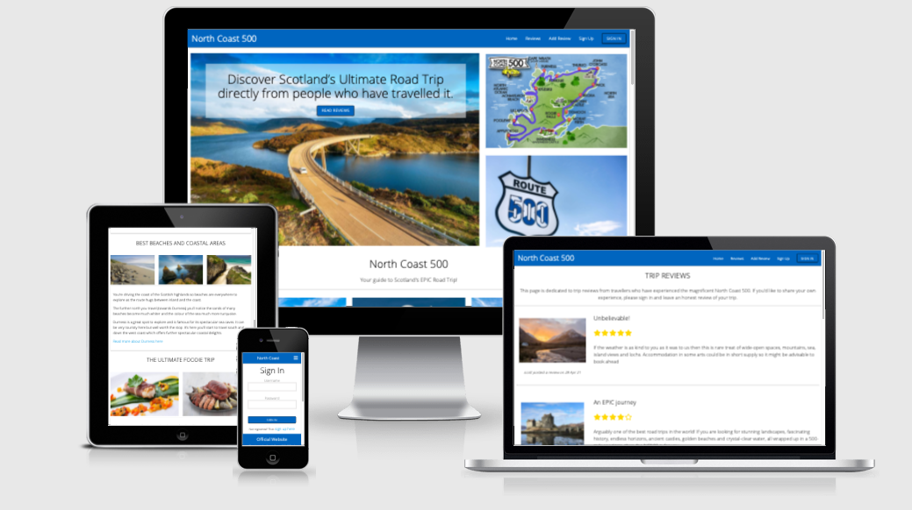

Welcome to the North Coast 500 - a Review Site for travellers embarking on Scotland's WORLD FAMOUS Road Trip! 

I built this travel information and review site for my third milestone project for the Code Institutes Full Stack Software Development Course.

### 
The image above is a visual of the site displayed on different devices using [I Am Responsive](http://ami.responsivedesign.is/#)

### 
You can view the live site here: [www.northcoast500.com](https://north-coast-500.herokuapp.com/)

---

## Contents

- [**User Experience (UX)**](#ux)
  - [User Stories](#user-stories)
  - [Strategy](#strategy)
    - [_External user’s goal_](#external-user’s-goal)
    - [_Site owner's goal_](#external-user’s-goal)
  - [Scope](#scope)
    - [_Scope In_](#scope-in)
    - [_Scope Out_](#scope-out)
  - [Structure](#structure)
  - [Skeleton](#skeleton)
    - [_Wireframes_](#mobile-wireframes)
  - [Surface](#surface)
    - [_Design_](#design)
    - [_Colour_](#colour)
    - [_Typography_](#typography)
- [**Features**](#features)
  - [_Existing Features_](#existing-features)
  - [_Features Left to Implement_](#features-left-to-implement)
- [**Technologies Used**](#technologies-used)
  - [_Languages_](#languages)
  - [_Frameworks & Libraries_](#frameworks-and-libraries)
- [**Testing**](#testing)
- [**Version Control Management**](#version-control-management)
- [**Deployment**](#deployment)
  - [_Deployment Steps_](#deployment-steps)
  - [_How To run this Project Locally_](#how-to-run-this-project-locally)
- [**Credits**](#credits)
  - [_Content_](#content)
  - [_Media_](#media)
  - [_Code_](#code)
- [**Resources**](#resources)
- [**Acknowledgements**](#acknowledgements)

---

## 
 UX

### User Stories

> - As a new website user, I want to understand the website purpose easily so that I remain interested in exploring the site further. 
> - s a new website user, I want to understand the reasons why I need to create an account so that I can make a decision on the value of doing so. 
> - As an existing user I want to be able to create and update my own personal reviews so that I have full control on the content I submit. 
> - As an existing user I want to be able to delete any review I have submitted so that I have full control on the content I submit. 
> - As an existing user, I want to be able to log out at any point when I am finished so that I know my account is secure. 

### Strategy

#### External user’s goal

- Read the reviews of others who have experienced the route in order to gain real life reviews that can help me make a decision. 
- Creating an account should be simple and quick, requiring as little personal information as possible.  -
-  Share my own experience with others by submitting reviews and rating my trip. 
- Access additional information outside the website to explore further and gain more insight (links to external sources, dedicated websites etc)

#### Site owner's goal

- Built a site that provides specific information to a targeted audience. 
- Create a site that allows users to submit reviews in order to share their experience with others. 
- Create a site that allows users to manipulate their review input by being able to update or delete their previous posts. 
- Create a site that is user friendly and provides the targeted user with inspiration and links to further information.

### Scope

#### Scope In

- A homepage that provides information about Scotland's north coast 500 road trip route, including the key stopping points along the route. 
- A visual image of the route above the fold on the website to draw the user’s initial attention to the route map and key stops along the way. 
- External links to all information outlines on the home page to allow the user to gain deeper information should they want to. 
- Provide information on places to stay, food and drink, beaches and coastal regions of the route, and scotland’s wildlife likely to be encountered along the route. 
- A review page containing all reviews submitted by other users. 
- Ability for new users to create an account on the site. 
- Ability for existing users to log into their account.
- A review form that allows users to create and submit a review. 
- An edit review form that allows users to update previously posted reviews. 
- A delete review form that allows users to remove previously posted reviews. 
- Ability to log out of the site. 

#### Scope Out

- Customer profile page
- Ability to like or add comments to other users' reviews. 
- Search functionality to allow users to search reviews. 

### Structure

### Skeleton

#### Wireframes

### Surface

#### Design

#### Colour

#### Typography

---

## 
Features

### Existing Features

### Features Left to Implement

---

## 
Technologies Used

### Languages

### Frameworks and Libraries

---

## 
Testing

### W3C Validation

### JSHint

### User Story Testing Validation

### Browser Validation

### Site Performance Validation

### Final Manual UAT Testing

### Debugging

#### Console Log:

#### Live Testing:

---

### 
 Fixed Bugs

---

### Remaining Bugs:

---

## 
Version Control Management

---

## 
Deployment

### Deployment Steps

### How To run this Project Locally

---

## 
Credits

### Content

### Media

### Code

---

## 
Resources

---

## 
 Acknowledgements

---

### 
Thank you!

