Welcome to the North Coast 500 - a Review Site for travellers embarking on Scotland's WORLD FAMOUS Road Trip! 

I built this travel information and review site for my third milestone project for the Code Institutes Full Stack Software Development Course.

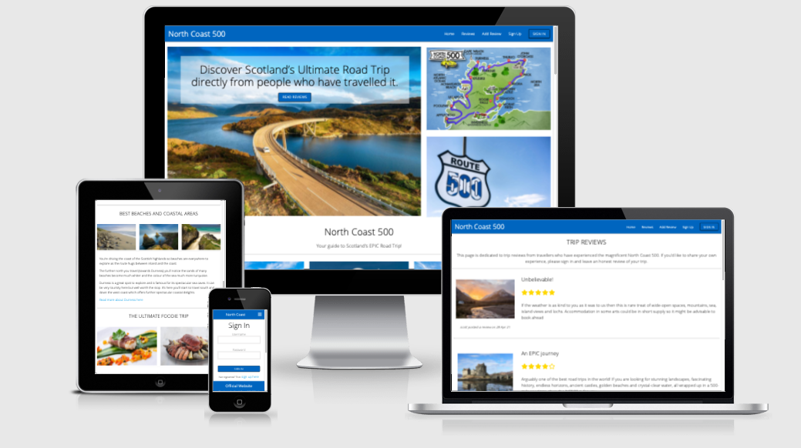

### 
The image above is a visual of the site displayed on different devices using [I Am Responsive](http://ami.responsivedesign.is/#)

### 
You can view the live site here: [www.northcoast500.com](https://north-coast-500.herokuapp.com/)

---

## Contents

- [**User Experience (UX)**](#ux)
  - [User Stories](#user-stories)
  - [Strategy](#strategy)
    - [_External user’s goal_](#external-user’s-goal)
    - [_Site owner's goal_](#external-user’s-goal)
  - [Scope](#scope)
    - [_Scope In_](#scope-in)
    - [_Scope Out_](#scope-out)
  - [Structure](#structure)
  - [Skeleton](#skeleton)
    - [_Wireframes_](#mobile-wireframes)
  - [Surface](#surface)
    - [_Design_](#design)
    - [_Colour_](#colour)
    - [_Typography_](#typography)
- [**Features**](#features)
  - [_Existing Features_](#existing-features)
  - [_Features Left to Implement_](#features-left-to-implement)
- [**Technologies Used**](#technologies-used)
  - [_Languages_](#languages)
  - [_Frameworks & Libraries_](#frameworks-and-libraries)
- [**Testing**](#testing)
- [**Version Control Management**](#version-control-management)
- [**Deployment**](#deployment)
  - [_Deployment Steps_](#deployment-steps)
  - [_How To run this Project Locally_](#how-to-run-this-project-locally)
- [**Credits**](#credits)
  - [_Content_](#content)
  - [_Media_](#media)
  - [_Code_](#code)
- [**Resources**](#resources)
- [**Acknowledgements**](#acknowledgements)

---

## 
 UX

### User Stories

> - As a new website user, I want to understand the website purpose easily so that I remain interested in exploring the site further. 
> - s a new website user, I want to understand the reasons why I need to create an account so that I can make a decision on the value of doing so. 
> - As an existing user I want to be able to create and update my own personal reviews so that I have full control on the content I submit. 
> - As an existing user I want to be able to delete any review I have submitted so that I have full control on the content I submit. 
> - As an existing user, I want to be able to log out at any point when I am finished so that I know my account is secure. 

### Strategy

#### External user’s goal

- Read the reviews of others who have experienced the route in order to gain real life reviews that can help me make a decision. 
- Creating an account should be simple and quick, requiring as little personal information as possible.  -
-  Share my own experience with others by submitting reviews and rating my trip. 
- Access additional information outside the website to explore further and gain more insight (links to external sources, dedicated websites etc)

#### Site owner's goal

- Built a site that provides specific information to a targeted audience. 
- Create a site that allows users to submit reviews in order to share their experience with others. 
- Create a site that allows users to manipulate their review input by being able to update or delete their previous posts. 
- Create a site that is user friendly and provides the targeted user with inspiration and links to further information.

### Scope

#### Scope In

- A homepage that provides information about Scotland's north coast 500 road trip route, including the key stopping points along the route. 
- A visual image of the route above the fold on the website to draw the user’s initial attention to the route map and key stops along the way. 
- External links to all information outlines on the home page to allow the user to gain deeper information should they want to. 
- Provide information on places to stay, food and drink, beaches and coastal regions of the route, and scotland’s wildlife likely to be encountered along the route. 
- A review page containing all reviews submitted by other users. 
- Ability for new users to create an account on the site. 
- Ability for existing users to log into their account.
- A review form that allows users to create and submit a review. 
- An edit review form that allows users to update previously posted reviews. 
- A delete review form that allows users to remove previously posted reviews. 
- Ability to log out of the site. 

#### Scope Out

- Customer profile page
- Ability to like or add comments to other users' reviews. 
- Search functionality to allow users to search reviews. 

### Structure

The structure of information on the site will follow a very simple design and navigation flow. As an information based website, the goal is to make the siete as easy as possible for the user to navigate.  
#### Home Page
- Main page with key relevant information on the website's purpose - the North Coast 500 road trip route. A map of the route is displayed above the fold to instantly allow the user to visualize the route as soon as they enter the website. 
- A link directing the user to the dedicated review page is also above the fold to allow customers to instantly navigate to this page if they wish to do so. 
#### Sign Up Page
- Contains the form that allows a new user to create an account. 
#### Sign In Page
- Contains the form that allows existing users to sign into their account.
#### Reviews Page
- A dedicated page containing the reviews posted by users of the site. This page is populated using the data submitted by users filling in a review form and submitting the review to the site.
#### Add Review Form
- An ‘ADD Review’ Tab is placed in the nav bar which allows the user to submit a review directly on the website. 
-- The Add Review Tab displays in the nav bar whether or not the customer is logged in, however, in the event the user is not logged in, when clicked a model will appear prompting the user to either sign in or create an account. If the user is logged in, they are directed straight to the review form. 
#### Edit Review & Delete Form
- Both of these forms are located within the reviews page and display only when the user is logged in and has previously submitted at least one review. 
Sign Out Tab
- This nav bar link allows the user to sign out of their account and will only display on the navbar if a user has signed into their account.
#### Footer 
- A fixed footer that contains additional information and navigational options for both new and existing users of the site. 

### Skeleton

- The website has been designed to allow the user to navigate through the journey effortlessly. 
- The nav bar links are designed to display relevant to whether the user is logged into the site or not. 
- The user will be immediately navigated to the main reviews page upon submitting a review. 
- When attempting to delete a review, the user will be navigated to a dedicated page that will provide additional protection in case the user clicked delete by mistake. 
- The user will flow to the login page after clicking the logout button, enabling them to log back in quickly if this was done in error. 

#### Wireframes

All wireframes were created using [Balsamic](https://balsamiq.com/).

### Surface

#### Design

The website’s sole purpose is to display information and reviews on Scotland’s north coast 500 road trip. This is an extremely scenic route through the Scottish mountains and around 500 miles of coastline. Therefore, the page is designed for lots of images. The main page has many images of the route to engage with the user as they are most likely on the page to help plan and visualise their dream road trip. 

#### Colour

The color scheme is very simple, white and blue, using the blue from the Scotish Flag as my inspiration for the site.

- #0065BF

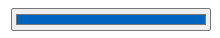

#### Typography

Typography
In line with websites simplicity I have only used one font throughout - Righteous! 

I really liked the simplicity of Open Sans and therfore didn't feel the need from a design perspective to add any additional fonts. 

---

## 
Features

### Existing Features
- A tab that allows users to ‘Add Review’ which is displayed whether the user is logged in or not.
- A model that appears after clicking the ‘Add Review’ Tab if the user is not logged in, the model containing information on how to add a review by either signing in or creating an account. 
- A sign up page that allows new users to create an account, which will allow the user to interact with the site. 
- A sign in page that will allow existing members to sign into their account in order to interact with the site. 
- Flash messaging to warn the user of specific actions - for example, advising the customer that a user name already exists if they try to create an account using a username that has already been taken. 
- Flash messaging to advise the customer that they have successfully created an account. 
- Flash messaging to warn the customer when they enter the wrong username and/or password when signing in. 
- All forms have validation to ensure the user enters the required parameters in each form throughout the site. 
- Password hashing to ensure security is enabled within the site. 
- Flash messaging to welcome the user upon signing in successful, displaying the users name on screen. 
- Add Review tab that displays a form that allows the user to create and submit a review directly onto the dedicated review page. 
- An ‘Update’ tab that appears only on the reviews submitted by the logged in user. The update tab when clicked will allow the user to edit their review. 
- Updated reviews when submitted are reloaded on the main review page within the site. 
- A ‘Delete’ Tab that allows appears only on the reviews submitted by the logged in user. 
- A ‘Cancel’ button on the delete review page that allows the customer to be able to change their mind after clicking the first delete button. 
- Ability to add an image url in the review form that allows users to add and submit an image with their review. 
- A sign out tab that allows the user to sign out of their session, with a flashed message to confirm to the user that sign out has been successful. 
- User ratings select drop down which converts into Star Ratings when the review is submitted. 
- Nav bar that displays certain links only when the user is signed into their account. 

### Features Left to Implement

- A user profile page which will display the users previously submitted reviews. 
- An add comments section which will allow users to ask questions within the community of existing members. 
- A like / helpful button which will allow users to like other users' reviews. 
- Expansion of the website to include other route trip routes around the globe. 
- Ability for users to sign up to email newsletters. 
- Admin functionality that will allow admin to moderate reviews and comments as the community grows. 

---

## 
Technologies Used

### Languages

- [HTML5](https://en.wikipedia.org/wiki/HTML5)
- [CSS3](https://en.wikipedia.org/wiki/CSS)
- [Python](https://www.python.org/)
- [JQuery](https://jquery.com/)

### Frameworks and Libraries
- [Pip3](https://pip.pypa.io/) - was used to install the required packages to run python.
- [Flask](https://flask.palletsprojects.com/en/1.1.x/) - Was used as the main micro framework for the web app.
- [WTForms](https://flask-wtf.readthedocs.io/en/stable/quickstart.html) - Was used to create all forms within the app.
- [Jinja](https://jinja.palletsprojects.com/en/2.11.x/) - Was used for all templating within python.
- [PyMongo](https://pypi.org/project/pymongo/) - Was used as the Python driver for MongoDB. 
- [Werkzeug](https://werkzeug.palletsprojects.com/en/1.0.x/) - used for password hashing within the user authentication process. 
- [Datetime](https://docs.python.org/3/library/datetime.html) - used to pull in date automatically when user post submitted to the site.
- [MongoDB](https://www.mongodb.com) - Was used as the primary database for the webapp.
-[Heroku](https://www.heroku.com/) - was used to deploy the webapp. 
[RandomKeygen](https://randomkeygen.com/) - Used to generate a random number which was used as the web app's SECRET_KEY.
- [Materialize](https://materializecss.com/) - was used for the navbar, the footer and the model structure.
- [Google Fonts](https://fonts.google.com/) - used to select the text font to be used throughout the site.
- [Gitpod](https://gitpod.io/) - used as my IDE.
- [Git](https://git-scm.com/) - used for version control via VS code by providing regular commits to Git, and pushing to GitHub.
- [GitHub](https://github.com/) - for my Git repository.
- [Balsamic](https://balsamiq.com/) - used to create the website wireframes.
- [Tinyjpg](https://tinyjpg.com/) - used for image resizing.
- [Favicon Generator](https://favicon.io/favicon-converter/) - used for generating the site favicon.
- [PEP8](http://pep8online.com/) - used to validate the code for the website. 
- [JS Hint](https://jshint.com/) - used to validate the javascript code within the website. 
- [Jigsaw](https://jigsaw.w3.org/css-validator/) - used to vaidate all CSS code. 
- [W3C Markup Validation](https://validator.w3.org/#validate_by_input) - used to validate the HTML within the code base. 

---

## 
Testing

### W3C Validation

The following pages were passed through the official W3C validation site with no errors returning:

- index.html: No errors or warnings to show.
- posts.html: No errors or warnings to show.
- register.html: No errors or warnings to show.
- login.html: No errors or warnings to show.
- add_post.html: No errors or warnings to show.
- edit_post.html: No errors or warnings to show.
- delete_post.html: No errors or warnings to show.

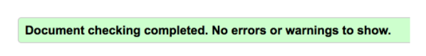

- style.css: Congratulations! No Error Found.

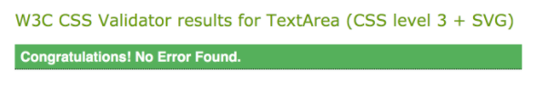

### JSHint

The following files were passed through JSHint with no warnings detected.

- script.js

### User Story Testing Validation

> #### 
_As a new website user, I want to understand the website purpose easily so that I remain interested in exploring the site further. 

I’ve designed the site in a way that as son as the user enters the site they immediately see what the page is about by displaying 3 key images above the fold:
- The large image  on the right displays a road with a car driving along it, instantly articulating a road journey. On this is a clear message to the customer - discovery and share. 
- A button has been added to the image to allow the customer to quickly navigate to the review site in order to read reviews posted by other users. A link to the review page is aslo contained within the nav bar.
- The top image on the right hand side displays a map of the road trip route. 
- The bottom right hand image displays the North 500 route sign. The route is commonly referred to as Scotland's route 66.

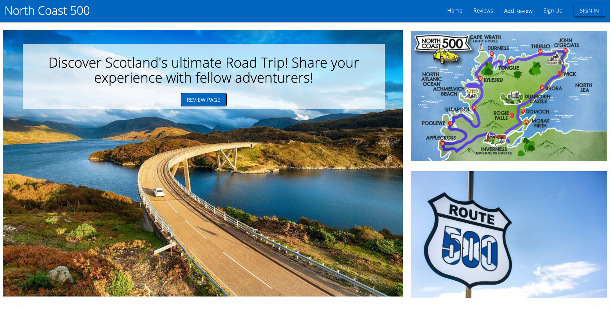
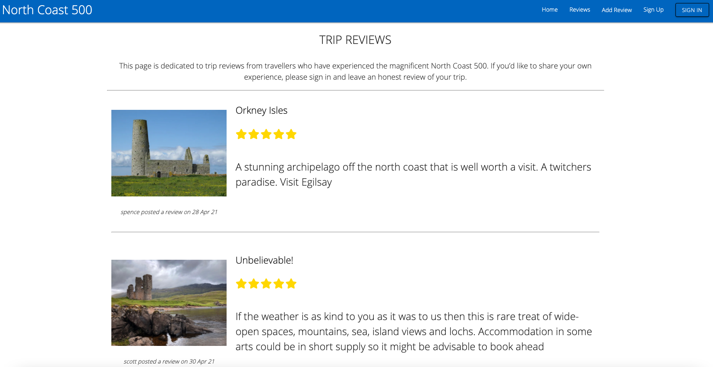

> #### 
_As a new website user, I want to understand the reasons why I need to create an account so that I can make a decision on the value of doing so. 

- To draw attention to the sign in functionality I have emphasised this within the nav bar - boxing it for additional focus. 
- The Sign in page is simple and clear and has been built to allow the customer to sign up at speed. The form is simple and requires the user to provide a username and password only in order to create an account. 

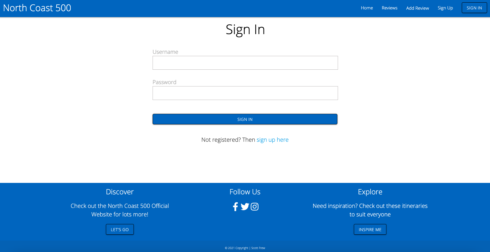

> #### 
_As an existing user I want to be able to create and update my own personal reviews so that I have full control on the content I submit. 

- The add review form allows customers to create and submit their own personal experiences with other site users. The form is simple and easy to fill in and pre-populates with the ‘Route’. This feature only has one option at present but has been built to allow the site owner to add additional routes that users can review.  
- The user can then edit their review once it has been submitted. To do this, the user needs to be logged in to their account to ensure only their review is protected and only they can edit. 
- The user can update their review as many times as they like, and have full control of the content they add or remove. 

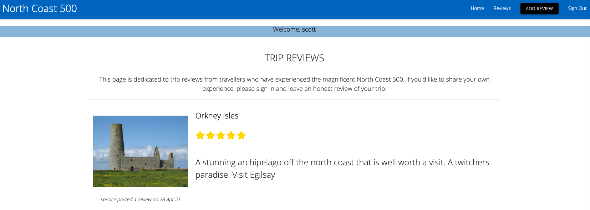
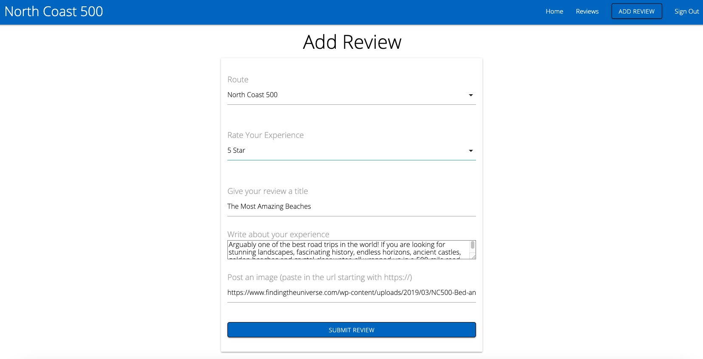
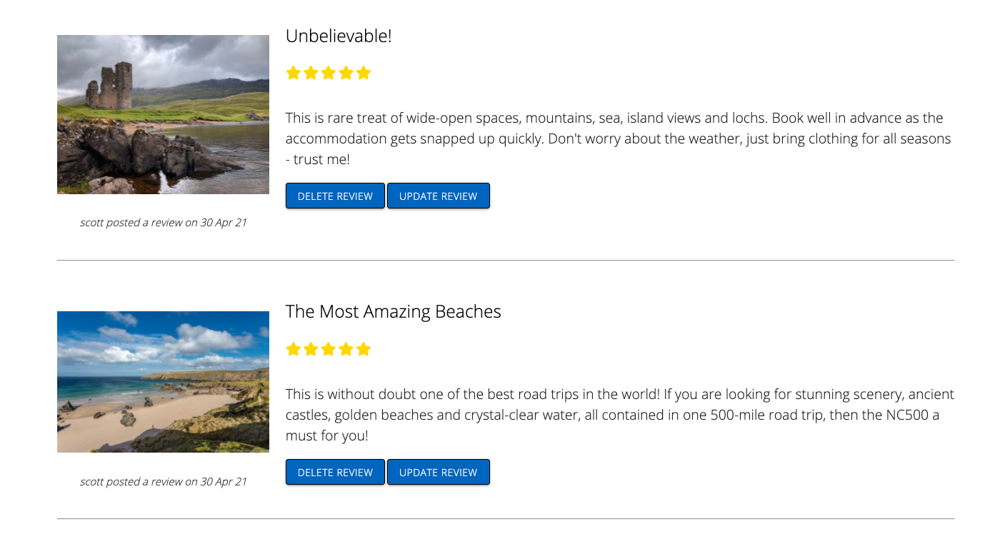
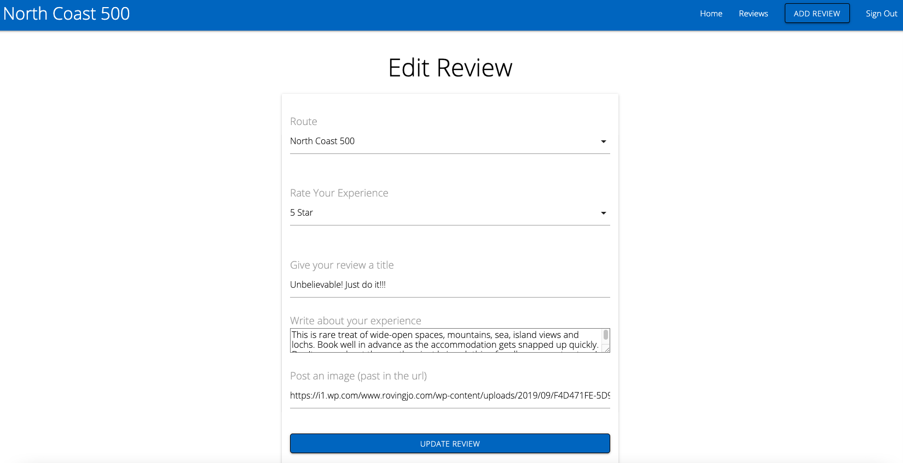

> #### 
_As an existing user I want to be able to delete any review I have submitted so that I have full control on the content I submit. 

- The user has full control with their content so once they are logged into their account, they have the ability to delete the review by clicking on the delete button underneath their post. 
- Once the delete button is clicked, the use will be directed to a ‘delete post’ page where they will be asked to confirm they wish to delete. 
- The confirm delete page pre populates the review title, providing the user with additional comfort that they have deleted the correct post. 
- There is a cancel button on the page, when clicked will take the customer back to the main reviews page - and of course, keeping the review alive. 

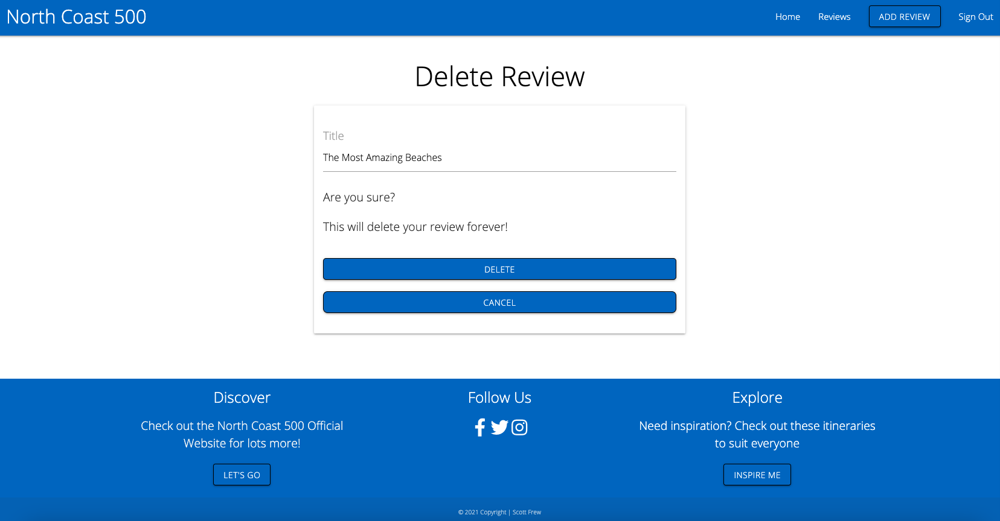

> #### 
_As an existing user, I want to be able to log out at any point when I am finished so that I know my account is secure. 

- Within the nav bar, the sign out button will appear once the user is logged into the web app allowing the user to log out quickly and easily. 
- Once the user clicks the sign out button, a flash message will appear to let the customer know they have logged out. 
- The user is then redirected to the login page on the site. This redirect is on purpose in case the user accidentally logs out and wishes to log back in. 

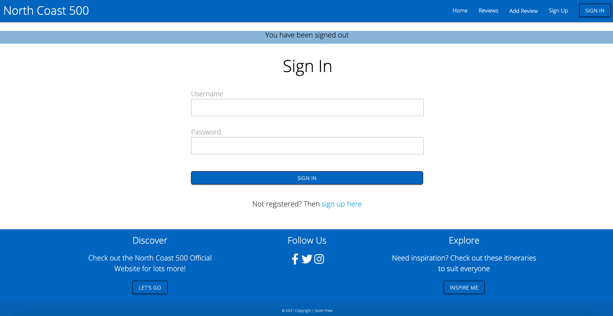

### Browser Validation

### Site Performance Validation

### Final Manual UAT Testing

### Debugging

#### Console Log:

#### Live Testing:

---

### 
 Fixed Bugs

---

### Remaining Bugs:

---

## 
Version Control Management

---

## 
Deployment

### Deployment Steps

### How To run this Project Locally

---

## 
Credits

### Content

### Media

### Code

---

## 
Resources

---

## 
 Acknowledgements

---

### 
Thank you!

